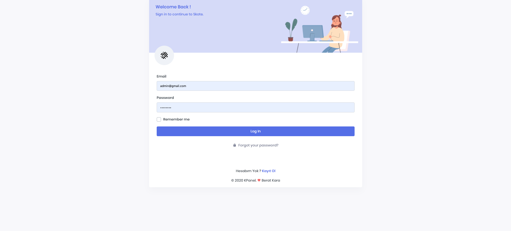
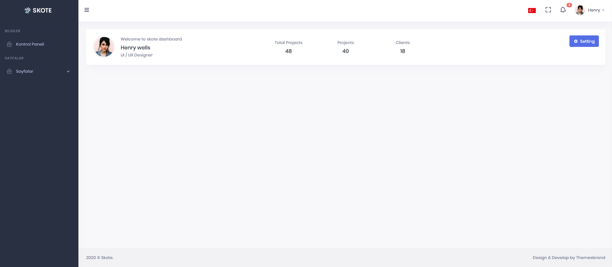

https://github.com/andersao/l5-repository#installation

### Installation 

````
cp .env.example .env

composer install

npm install

php artisan key:generate

php artisan jwt:secret

````

### Postgresql eklentileri
````
CREATE EXTENSION pgcrypto;
````

### Veritabanı Tablolarının Oluşturulması
````
php artisan migrate:fresh --seed
````

### Frontend Derlenmesi
````
npm run watch
````

### Sistemin Çalıştırılması
````
php artisan serve
````

### Örnek Kullanımlar
````
php artisan list

php artisan make:migration create_dealers_table --create=dealers

php artisan make:entity Dealers

php artisan make:controller Api/DealersController --api

php artisan make:resource Dealers
````




